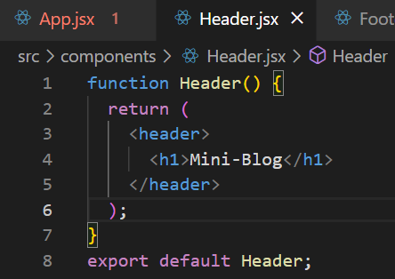
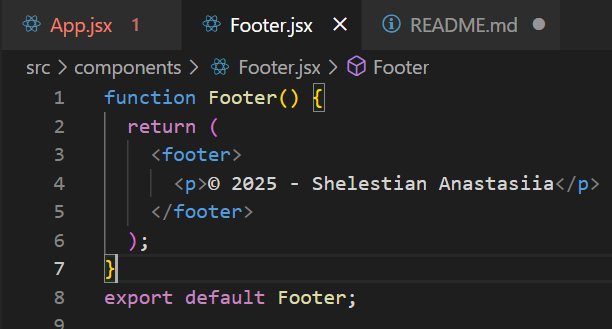
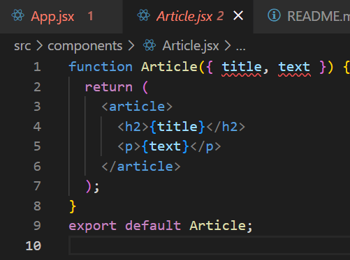
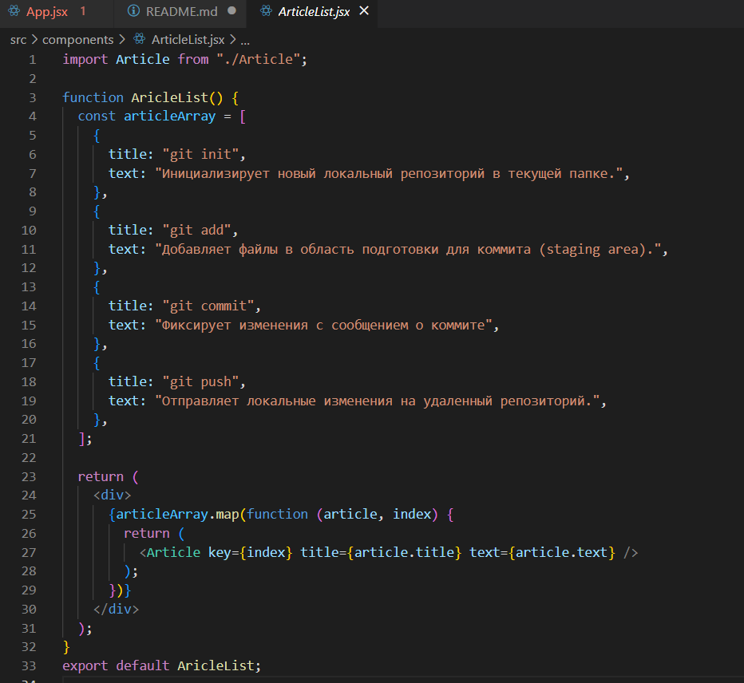
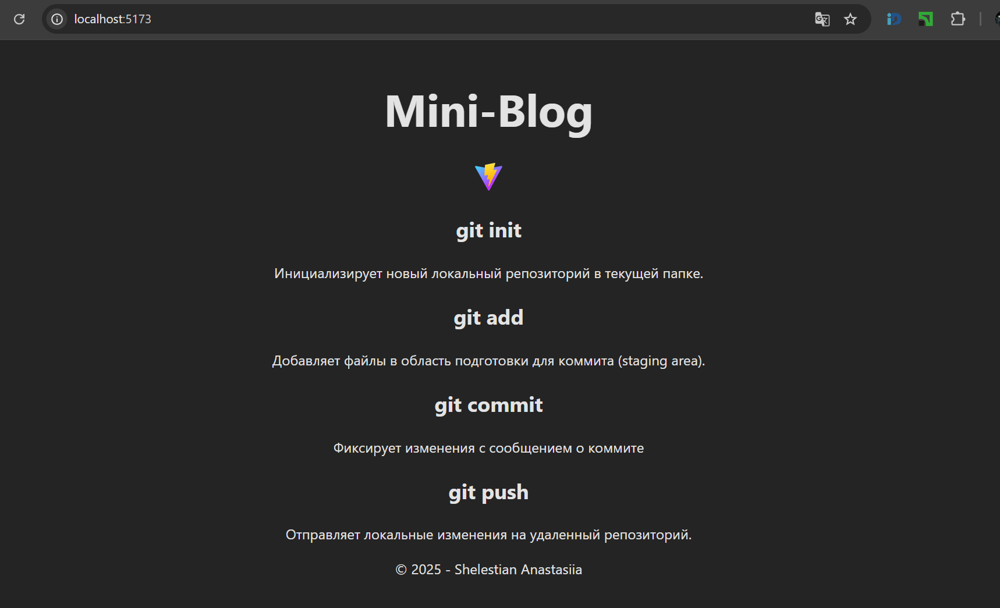

# Отчет по лабороторной работе №1 Введение в React. Компоненты

## Цель работы

### Познакомиться с библиотекой React, изучить основные концепции, научиться создавать и запускать React-приложение

## Шаг 1:

## Есть несколько вариантов создания React-приложения и ниже я пердставлю основыне меты для этого

### С помощью Vite (быстрый и современный подход). Быстрая сборка и удобная настройка.

```
npm create vite@latest my-app --template react
cd my-app
npm install
npm run dev
```

### С помощью Create React App (классический вариант). Хорошо документированный инструмент, подходит для новичков.

```
npx create-react-app my-app
cd my-app
npm start
```

### С помощью Next.js (для SSR и SEO). Поддержка серверного рендеринга и маршрутизации "из коробки."

```
npx create-next-app@latest
cd my-app
npm run dev
```

## Шаг 2

### Создайте компонент Header, который будет отображать заголовок страницы.

Файл Header.js в папке src/components.
В файле Header.js создала функциональный компонент Header, который возвращает JSX-разметку с заголовком


## Шаг 3

### Создайте компонент Footer, который будет отображать подвал страницы,

Создаkf файл Footer.js в папке src/components.
В файле Footer.js создаkf функциональный компонент Footer, который возвращает JSX-разметку с подвалом.


## Шаг 4

### Создала компонент Article, который будет отображать статью.

Создала файл Article.js в папке src/components.
В файле Article.js создала функциональный компонент Article, который возвращает JSX-разметку с заголовком и текстом статьи.
Функция Article примает в себя два параметра title & text


## Шаг 5 Создала компонент ArticleList, который будет отображать список статей.

### Создала файл ArticleList.js в папке src/components.

В файле ArticleList.js создала функциональный компонент ArticleList, который возвращает JSX-разметку со списком статей. Также созда массив articleArray с названием статей и текста и использовала его для создания масива из элементов Article.
Использую .map для прохода по массиву.


## Шаг Тестирование компонентов:



# Ответы на контрольные вопросы:

## Что такое JSX и зачем он используется в React?

JSX (JavaScript XML) — это синтаксическое расширение JavaScript, которое позволяет писать HTML-подобный код прямо в JavaScript-файлах.
Зачем:

Упрощает создание и чтение интерфейсов.
Позволяет динамически вставлять данные и обрабатывать события

## Чем функциональные компоненты отличаются от классовых?

Функциональные проще, используют хуки; классовые сложнее и используют state и методы жизненного цикла.

## Как передавать данные в компонент через props?

Через атрибуты компонента

## В каком формате принимаются props в функциональном компоненте?

В виде объекта
