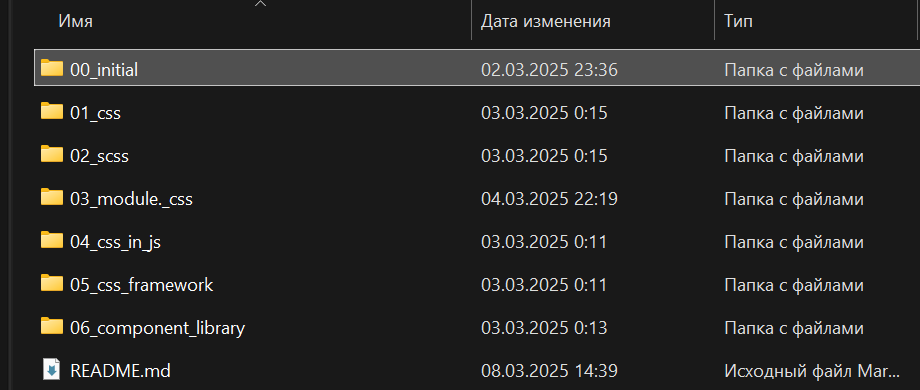

# Отчет по Лабораторной работе №2. Стилизация компонентов в React

## Цель работы

#### Овладение различными методами стилизации компонентов в React, их преимуществами и недостатками, а также освоение принципов их применения в современных веб-приложениях. Развитие навыков осознанного выбора методологии стилизации в зависимости от требований проекта и условий поддержки кода.

# Задание 1. Подготовка среды



# Задание 2. Стилизация компонентов

## 1. Обычные CSS-файлы (глобальные и локальные стили)

#### CSS-файлы можно подключать как глобально, так и локально для отдельных компонентов:

Глобальное подключение (для всего приложения)

В index.js или App.js импортируем глобальный CSS-файл:  
` import './styles.css';`  
Все стили из styles.css будут применяться ко всему приложению.
Локальное подключение (только для конкретного компонента)  
В файле компонента импортируем его собственный CSS-файл:  
`import './Button.css';`  
Тогда стили из Button.css будут применяться только к тегам внутри компонента Button.

## ✅ Плюсы

✔ Простота и привычность (обычный CSS).  
✔ Лёгкость в использовании.  
✔ Хорошая поддержка браузерами.

## ❌ Минусы

✖ Глобальные стили могут создавать конфликты (классы могут переопределять друг друга).  
✖ При больших проектах сложно управлять стилями и поддерживать читаемость.

# 2. SCSS (Sass) — препроцессор для CSS

Устанавливаем node-sass, если он не установлен:  
` npm install sass`  
В компоненте импортируем SCSS-файл так же, как обычный CSS:

`import './Button.scss'; `  
Основные возможности SCSS  
✅ Переменные  
✅ Вложенность  
✅ Миксины (шаблоны стилей)

## Сценарии использования

Проекты со сложной стилизацией.  
Если нужна мощная система управления стилями.  
Если используются повторяющиеся стили, которые удобно оформлять в миксины.

## ✅ Плюсы

✔ Улучшает организацию кода.  
✔ Позволяет переиспользовать стили с помощью переменных и миксинов.  
✔ Удобнее управлять большими стилевыми файлами.

## ❌ Минусы

✖ Требует компиляции (немного увеличивает время сборки).  
✖ При неправильной структуре может превратиться в "кашу" из вложенных селекторов.

# 3. CSS-модули (CSS Modules) — инкапсуляция стилей

Создаём файл с расширением .module.css:

```
/* Button.module.css */
.button {
  background-color: blue;
  color: white;
}
```

В компоненте импортируем стили как объект:

```
import styles from './Button.module.css';

function Button() {
  return <button className={styles.button}>Click me</button>;
}
```

## Сценарии использования

Когда важно избежать конфликтов стилей.  
Для средних и больших проектов.  
В сочетании с CSS-препроцессорами.

## ✅ Плюсы

✔ Полностью избегает конфликтов имен классов (инкапсуляция).  
✔ Автоматически генерирует уникальные имена классов (Button_button\_\_1a2b3).  
✔ Хорошо работает с крупными проектами.

## ❌ Минусы

✖ Неудобно использовать с динамическими классами.  
✖ Немного сложнее для начинающих, чем обычный CSS.

# 4. CSS-in-JS (Styled Components, Emotion и др.)

Устанавливаем библиотеку styled-components:

`npm install styled-components`  
Создаём стилизованный компонент:

```
import styled from 'styled-components';

const Button = styled.button`
  background-color: blue;
  color: white;
  padding: 10px;
  border-radius: 5px;

  &:hover {
    background-color: darkblue;
  }
`;

function App() {
  return <Button>Click me</Button>;
}
```

## Сценарии использования

Если стили должны зависеть от пропсов.  
Когда требуется динамическое обновление стилей.  
В проектах с темизацией.

## ✅ Плюсы

✔ Позволяет использовать стили прямо в JS.  
✔ Полностью изолированные стили без конфликтов.  
✔ Можно передавать пропсы в стили:

`` const Button = styled.button`
background-color: ${(props) => (props.primary ? 'blue' : 'gray')};
`; ``

## ❌ Минусы

✖ Может замедлять рендеринг, если много динамических стилей.  
✖ Код становится менее читаемым, если стили большие.  
✖ Иногда сложнее отлаживать (стили генерируются в runtime)

# 5. CSS-фреймворки (Tailwind CSS и другие)

Устанавливаем Tailwind:  
`npm install tailwindcss @tailwindcss/vite`
Импортируем:

```
import { reactRouter } from "@react-router/dev/vite";
import { defineConfig } from "vite";
import tsconfigPaths from "vite-tsconfig-paths";
import tailwindcss from "@tailwindcss/vite";
export default defineConfig({
  plugins: [
    tailwindcss(),
    reactRouter(),
    tsconfigPaths(),
  ],
});
```

Используем классы прямо в JSX:

```
function Button() {
  return <button className="bg-blue-500 text-white px-4 py-2 rounded">Click me</button>;
}
```

## Сценарии использования

Быстрая стилизация без написания кастомного CSS.  
Современные UI-библиотеки.  
Если важна производительность (удаляет неиспользуемые стили).

## ✅ Плюсы

✔ Ускоряет верстку благодаря готовым утилитарным классам.  
✔ Хорошо оптимизирован (удаляет неиспользуемые стили).  
✔ Отличная кастомизация через конфиг.

## ❌ Минусы

✖ Загромождает HTML-код длинными классами.  
✖ Требует привыкания к подходу "утилитарных классов".  
✖ Меньше контроля над глобальными стилями.

# 📌 Контрольные вопросы

### Какие методы стилизации предпочтительнее для больших проектов?

CSS-модули и CSS-in-JS

CSS-модули предотвращают конфликты классов.

CSS-in-JS удобен для динамических стилей и темизации.

Tailwind CSS тоже подходит, если используется правильная архитектура.

### Какие плюсы и минусы у CSS-фреймворков?

✅ Преимущества  
✔ Быстрая разработка.  
✔ Уменьшение кастомного CSS.  
✔ Оптимизация (удаление неиспользуемых классов).

❌ Недостатки  
✖ Загромождение JSX длинными классами.  
✖ Требуется изучение специфического синтаксиса.  
✖ Ограниченные возможности кастомизации.

### Чем CSS-модули отличаются от обычных CSS-файлов и SCSS?

CSS-модули:  
Автоматически генерируют уникальные классы.  
Инкапсулируют стили в компонентах.  
Решают проблему глобальных конфликтов.

SCSS:  
Улучшает организацию CSS-кода (переменные, вложенность, миксины).
Но не предотвращает конфликты имен классов.

### Какие плюсы и минусы у CSS-in-JS?

✅ Преимущества:  
✔ Позволяет динамически изменять стили.  
✔ Инкапсулирует стили и предотвращает конфликты.  
✔ Хорошо подходит для темизации.

❌ Недостатки:  
✖ Генерирует стили во время рендеринга (может замедлять).  
✖ Код становится менее читаемым, если стили большие.  
✖ Необходимость дополнительной библиотеки (styled-components).
